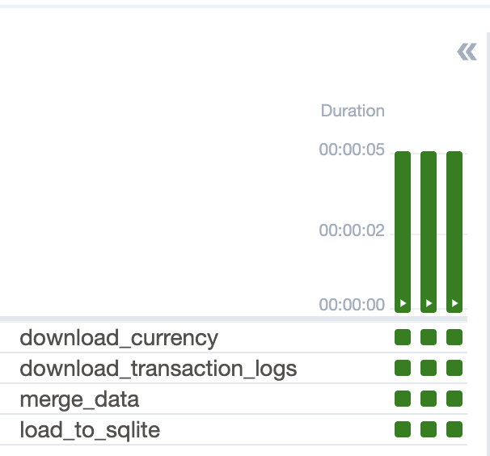

# Тестовые задания

## Обычный ETL-пайплайн без airflow

Файл находится в этой же директории с оригинальным названием

## ETL-пайплайн с использованием CustomOperators

Для запуска: `docker-compose up`

Часть кода из второго задания, которую нужно было поместить в файл dag.py закомментировал.

Кастомные операторы выведены в отдельный файл `dags/custom_operators.py` и как модуль импортированы в файле `dags/dag.py`

### Конфигурация airflow:

Версия: 2.7.1 (как в google colab)

БД для метаданных: Postgres

Порт который слушает airflow - по умолчанию: `8080`

Логин: `airflow`

Пароль: `airflow`

В конфигурации тестовые DAGи отключены, поэтому в веб-сервере будет отображаться только 1 основной DAG

Среднее время выполнения DAGа 5 секунд:

Для теста загруженных в БД данных можно запустить скрипт:
`python data/check.py` если перейти в директорию data/
или
`cd data && python check.py` если с корневой директории

(Так как идет подключение к БД, а в файле подключение идет так как будто БД в директории вместе с проверочным файлом)
